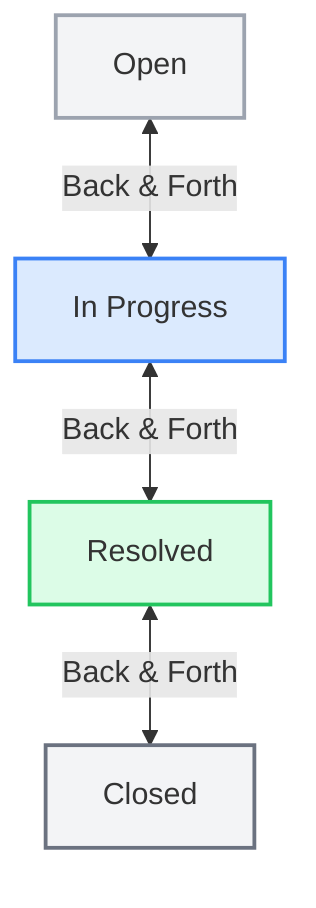

# DeskFlow — Support Ticket Triage Board

DeskFlow is a production-ready, beautiful Support Ticket Triage Board built using the **MERN Stack** (MongoDB Atlas, Express.js, React.js with Vite, Node.js). 

It features an interactive glassmorphic Kanban Board, strict status transition guardrails, real-time-like SLA breach tracking, dynamic statistics, and smooth optimistic UI updates with custom HTML5 Drag and Drop events.

---

## 📂 Project Structure

```
bajaj/
├── backend/
│   ├── config/
│   │   └── db.js               # Mongoose database connector
│   ├── controllers/
│   │   └── ticketController.js # Controllers mapping core logic (CRUD + dynamic stats)
│   ├── middleware/
│   │   └── errorHandler.js     # Express global error handler
│   ├── models/
│   │   └── Ticket.js           # Mongoose Schema, dynamic SLA virtuals, enums
│   ├── routes/
│   │   └── ticketRoutes.js     # API Route endpoint mappings
│   ├── .env.example
│   ├── .env                    # Created locally for credentials
│   ├── package.json
│   ├── server.js               # Express app entry configuration
│   └── test_api.js             # Local direct validation script for state rules
└── frontend/
    ├── src/
    │   ├── components/
    │   │   ├── Filters.jsx     # Priority filters and SLA breach toggles
    │   │   ├── Header.jsx      # Top nav brand banner & light/dark switch
    │   │   ├── StatsStrip.jsx  # Dynamic responsive counts aggregates
    │   │   ├── TicketBoard.jsx # 4-column drag/drop target panel
    │   │   ├── TicketCard.jsx  # Interactive card, live timer, status triggers
    │   │   └── TicketForm.jsx  # Creation portal with inline validator displays
    │   ├── services/
    │   │   └── api.js          # Axios API service client layer
    │   ├── App.jsx             # Top-level state and optimistic UI coordinator
    │   ├── index.css           # Premium glassmorphic design token stylesheet
    │   └── main.jsx            # Vite DOM renderer
    ├── .env.example
    ├── .env                    # Points to development backend url
    ├── vite.config.js
    ├── index.html              # Main HTML entry with SEO metadata and Outfit font
    └── package.json
```

---

## ⚡ Quick Start — Run Locally

### Prerequisites
- Node.js (v16.0.0 or higher recommended)
- MongoDB running locally (`mongodb://localhost:27017`) or a MongoDB Atlas URI string.

### Step 1: Install Dependencies
Open a terminal in the root directory `bajaj/` and run the following commands:

```bash
# Install backend dependencies
cd backend
npm install

# Install frontend dependencies
cd ../frontend
npm install
```

### Step 2: Set up Environment Configs
Ensure you have created the `.env` configuration files inside both folders:

**Backend Environment Config (`backend/.env`):**
```env
PORT=5000
MONGODB_URI=mongodb://localhost:27017/deskflow
```

**Frontend Environment Config (`frontend/.env`):**
```env
VITE_API_URL=http://localhost:5000
```

### Step 3: Run the Servers
Start both the backend server and Vite frontend dev server in separate terminal windows:

**Start Backend Development Server (Port 5000):**
```bash
cd backend
npm run dev
```

**Start Frontend Development Server (Port 3000):**
```bash
cd frontend
npm run dev
```

The application will automatically open in your default browser at `http://localhost:3000`.

---

## 🧪 Run Automated Verification Tests
We have built a dedicated test suite `test_api.js` to automatically verify transition limitations, SLA derivations, invalid emails, and state reversion regulations.

Ensure your local MongoDB database is running, then run:
```bash
cd backend
node test_api.js
```

---

## ⚙️ Core Application Logic

### 1. SLA Targets & Dynamic Calculation
SLA breaches are evaluated **dynamically at query runtime** through Mongoose Virtual properties (`ageMinutes` and `slaBreached`). This guarantees that age counts are always correct and never stale.
- **Urgent Priority**: 1 hour (60 minutes) target.
- **High Priority**: 4 hours (240 minutes) target.
- **Medium Priority**: 24 hours (1440 minutes) target.
- **Low Priority**: 72 hours (4320 minutes) target.

*Derived fields formulas:*
- For unresolved tickets: `ageMinutes = Date.now() - createdAt`
- For resolved tickets: `ageMinutes = resolvedAt - createdAt`
- `slaBreached`: `true` if `ageMinutes > targetMinutes`, otherwise `false`.

### 2. Strict Status Transition Engine
DeskFlow enforces a precise progression flow on status changes to secure data compliance:



**Direct skipping is strictly prohibited.** E.g., trying to transition `open` -> `resolved` directly returns a `400 Bad Request` validation payload from the API.

- **Reversion backward:** 
  - When reverting `resolved` -> `in_progress`, the `resolvedAt` timestamp is automatically nullified (`null`).
- **Resolution forward:** 
  - When transitioning a ticket *to* `resolved` (from `in_progress` or `closed`), the `resolvedAt` timestamp is automatically initialized with the current server time.

---

## 🚀 Preparing for Production Deployment

### Backend Deployment (e.g. Render / Railway)
1. Commit all files (excluding `.env`) to a Github Repository.
2. Deploy the `backend/` subfolder on Render.
3. Configure the environment variables on the Render dashboard:
   - `PORT`: Set to `10000` (or let Render assign it)
   - `MONGODB_URI`: Connect to your live production **MongoDB Atlas connection string**.
   - `NODE_ENV`: Set to `production`.

### Frontend Deployment (e.g. Vercel)
1. Deploy the `frontend/` subfolder on Vercel.
2. Configure Environment Variable:
   - `VITE_API_URL`: Specify the live deployed Render URL (e.g., `https://deskflow-api.onrender.com`).
3. Set the Vite build output directory to `dist` (default).

---

## 💎 Design System & Visual Aesthetics
DeskFlow utilizes a high-fidelity modern UI to deliver an immersive triage hub:
- **Responsive Layout**: Designed with custom responsive grids and flex layouts, perfectly adjusting across desktop, tablet, and mobile screens.
- **Color Coding**: Badges and status banners use highly harmonic HSL priority colors for immediate cognitive recognition.
- **Glassmorphism**: Backdrop filters (`blur`), glowing hover shadows (`var(--glow-shadow-primary)`), and border borders create a sleek glass-like look.
- **SLA Live Ticks**: Unresolved cards continuously tick age counts forward in real-time, instantly shifting status tags and flashing red warnings if an SLA breaches.
- **Optimistic UI Engine**: Dragging a card to a column instantly moves the card and refreshes stats in the frontend. If the backend returns a transition error, the card is rolled back immediately with an elegant alert toast.
